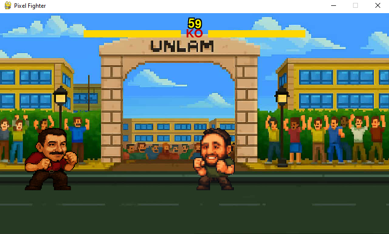

# 🎮 Pixel-Fighter

Pixel-Fighter es un juego de peleas estilo retro desarrollado con Pygame y box2d, que enfrenta a dos personajes en combates dinámicos usando ataques cuerpo a cuerpo y proyectiles. El juego está ambientado en escenarios pixel art y cuenta con animaciones fluidas, efectos de sonido y música de fondo.

---

## 🛠️ Configuración

1. **Crear el entorno virtual**

```bash
python -m venv venv
```

2. **Activar el entorno**

- En **Windows**

  ```cmd
  venv\Scripts\activate
  ```

- En **Linux/macOS**

  ```bash
  source venv/bin/activate
  ```

3. **Instalar dependencias**

```bash
pip install -r requirements.txt
```

4. **Ejecutar el juego**

```bash
# Desde la raíz del proyecto
python main.py
# o
python3 main.py  # si el anterior no funciona
```

---

## 🕹️ Controles

### Jugador 1:

- `A` / `D`: Moverse a izquierda / derecha
- `W`: Saltar
- `F`: Ataque cuerpo a cuerpo
- `G`: Bloquear
- `S`: Ataque a distancia

---

## 🧩 Características del juego

- Modo de combate single player
- Colisiones físicas realistas usando Box2D
- Efectos de sonido personalizados
- Sprites animados estilo pixel art
- IA básica para el jugador2

---

## 📦 Requisitos

- Python 3.7+
- Pygame
- Box2D

(Instalados automáticamente desde `requirements.txt`)

---

## 📸 Capturas

```

```

---

## 👨‍💻 Créditos

Nicolas Vazquez
Cristian Cespedes
Matias Albanesi
Mara Guerrera
Pablo vivas
---

## 📄 Licencia

Este proyecto se distribuye bajo la licencia MIT. Ver [LICENSE](LICENSE) para más información.
